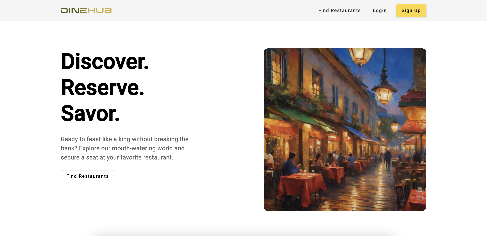
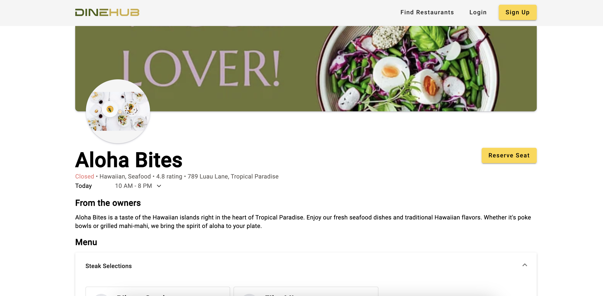
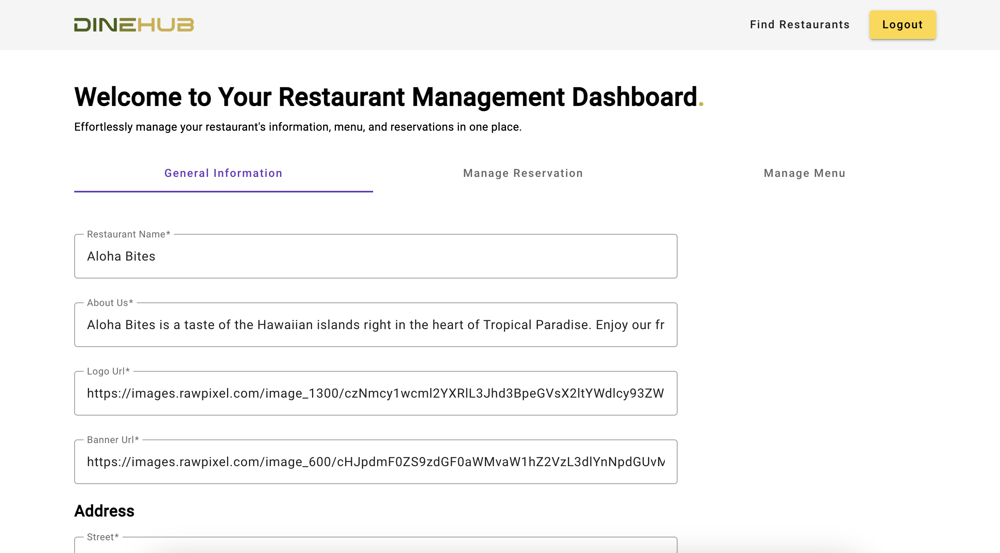

# DineHub - Restaurant Reservation Application

DineHub is a user-friendly restaurant reservation application designed to streamline the dining experience by enabling users to reserve seats in advance. This application is equipped with a feature-rich Angular frontend that incorporates Material UI for visually appealing and responsive user interface components. The backend is powered by Spring Boot, providing robust and scalable server-side functionality.

## Features

- **User-Friendly Reservation:** Easily reserve seats in your favorite restaurants.
- **Time-Saving:** Skip the wait with advance seat reservations for a smoother dining experience.

## Technologies Used

- **Frontend:** Angular, Material UI
- **Backend:** Spring Boot

## Getting Started

To run the project locally, follow these steps:

1. **Clone the Repository:**

   ```bash
   git clone https://github.com/your-username/dinehub.git

   ```

2. **Install Dependencies:**

   ```bash
   npm install

   ```

3. **Run the Angular Application:**

   ```bash
   ng serve

   ```

4. **Access the Application:**<br/>
   Open your browser and go to http://localhost:4200 to access the DineHub application.

## Screenshots (Development Preview)

### Home Page



### Restaurant Page



### Dashboard Page



## License

This project is licensed under the [MIT License](https://github.com/git/git-scm.com/blob/main/MIT-LICENSE.txt).
